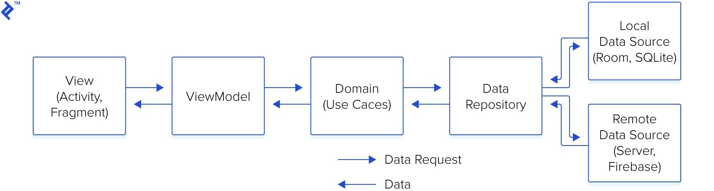

# xmash_app

```
lib/
├── core/
│   ├── constants/              # 상수 값들
│   │   ├── app_constants.dart
│   │   └── theme_constants.dart
│   ├── errors/                 # 에러 처리
│   │   └── failures.dart
│   └── utils/                  # 유틸리티 함수들
│       └── helpers.dart
│
├── data/
│   ├── datasources/            # 데이터 소스 (API, 로컬DB 등)
│   │   ├── local/
│   │   └── remote/
│   ├── models/                 # 데이터 모델
│   │   └── match_model.dart
│   └── repositories/           # 레포지토리 구현
│       └── match_repository_impl.dart
│
├── domain/
│   ├── entities/               # 비즈니스 엔티티
│   │   └── match.dart
│   ├── repositories/           # 레포지토리 인터페이스
│   │   └── match_repository.dart
│   └── usecases/              # 유즈케이스
│       └── get_matches.dart
│
├── presentation/
│   ├── screens/               # 화면
│   │   ├── home/
│   │   └── match_list/
│   ├── widgets/               # 재사용 가능한 위젯
│   │   ├── common/
│   │   └── match_list/
│   └── providers/            # 상태 관리 (Provider, Bloc 등)
│       └── match_provider.dart
│
├── config/                   # 환경설정
│   ├── routes/              # 라우트 설정
│   │   └── app_routes.dart
│   └── themes/              # 테마 설정
│       └── app_theme.dart
│
└── main.dart
```

```
lib/
├── config/ # 설정 관련
├── core/ # 공통 기능들
├── data/ # 데이터 처리 관련 코드
│   ├── local/ # SQLite, Room 등
│   └── remote/ # API, supabase 등
├── domain/ # 비즈니스 로직
├── models/ # 데이터 모델
├── presentation/ # 상태관리 관련 코드 (ViewModel)
├── ui/ # UI 관련 코드 (View)
└── main.dart
```


* 해당 사진의 의존관계를 확인하고 코드 작성 필요

# 모듈 구조
코드를 분리하기 위한 3개의 주요 모듈: Data, Domain, Application
- Data: 로컬 저장소, API, 데이터 객체(요청/응답 객체, DB 객체), 저장소 구현 포함
- Domain: 비즈니스로직, 도메인 객체/모델, 저장소 인터페이스 포함
- Application: UI, 뷰 객체, 위젯 등 포함. 필요시 별도 모듈로 분리 가능(ex:카메라, 위치 등을 다루는 Device 모듈)

# 모듈 설명
- core: 공통 기능들
- data: 데이터에서는 외부 내부 데이터를 순수하게 가져오기만 해야함
- domain: 데이터에서 가져온 데이터를 통해 비즈니스 로직을 구현함
- presentation: UI 변경에 따라 비즈니스 로직을 호출함
- ui: UI 사용자 입력에따라 presentation에 정의된 비즈니스 로직을 호출함

